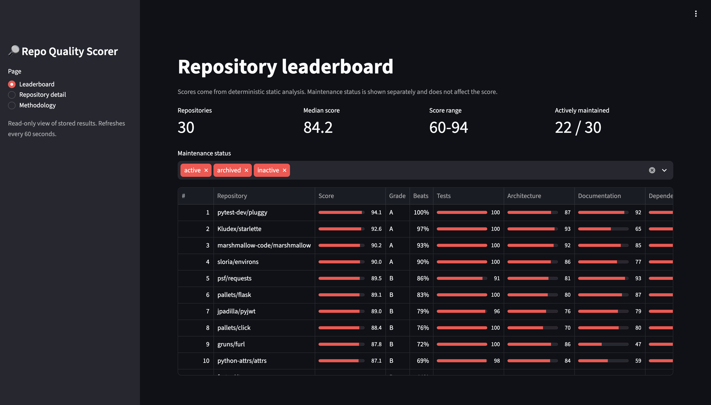
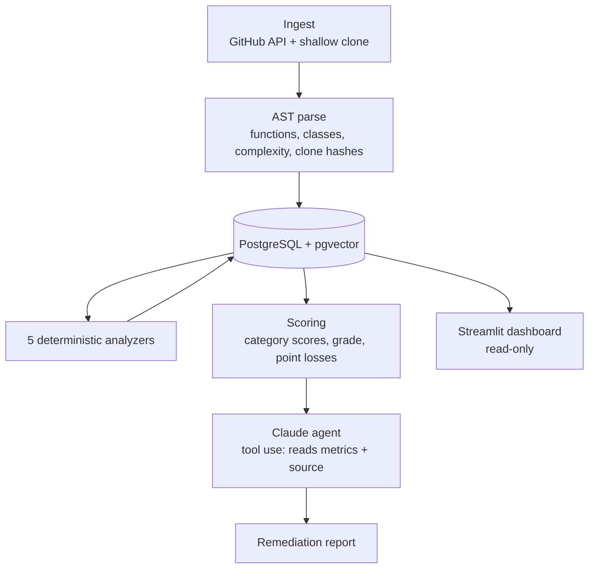

# GitHub Repo Quality Scorer

[](https://github.com/Aniruddhachitte26/repo-quality-scorer/actions/workflows/ci.yml)

An agentic system that scores the code quality of open-source Python repositories across
**tests, architecture, documentation, dependencies and duplication**, then uses a Claude
agent to investigate the weakest areas and write a prioritized remediation plan.

**Core design rule:** deterministic static analysis computes every score; the LLM only
*interprets* the results. The same repo at the same commit always gets the same score, and
every point lost is traceable to a specific metric.



---

## Results: 30 repositories

All 30 repositories were scored for $0 (analysis runs locally; only the optional Claude
reports use API credits). Repos were chosen in three groups by reputation, to test whether
the scorer agrees with it:

| Group | Description | Avg score | Actively maintained |
|-------|-------------|-----------|---------------------|
| A | Widely used, actively maintained (requests, flask, starlette...) | **87.4** | 10 / 10 |
| B | Established, mid-sized (marshmallow, pyjwt, tqdm...) | **85.1** | 10 / 10 |
| C | Small, older or unmaintained side projects | **74.9** | 2 / 10 |

Scores order as expected (A > B > C). Top 3: `pytest-dev/pluggy` 94.1,
`Kludex/starlette` 92.6, `marshmallow-code/marshmallow` 90.2. Median 84.2, range 60-94.

Maintenance (archived / last push) is shown **next to** the score, never inside it: the score
answers *"is the code good?"*, maintenance answers *"is anyone looking after it?"*. For
example, `kennethreitz/maya` scores 86.5 because its code is small, clean and well tested,
while its badge shows *Inactive*.

---

## Architecture



Every stage stores its output in Postgres, so any stage can be re-run on its own
(e.g. `reanalyze` after changing a rule, without re-cloning anything).

| Stage | How it works |
|-------|--------------|
| **Ingest** | GitHub REST API for metadata (follows redirects for renamed repos), GitPython shallow clone |
| **Parse** | Python's `ast`: every function/method/class with McCabe complexity, docstring and type-hint coverage, and a normalized structural hash |
| **Documentation** | Public docstring coverage, full type-hint coverage, README heuristics, docs folder |
| **Architecture** | Import graph with `networkx` (cycles, fan-out; ignores `TYPE_CHECKING` and function-level imports), complexity, long functions, god classes |
| **Dependencies** | Parses `pyproject.toml` / `setup.cfg` / `setup.py` / requirements; checks PyPI (latest, staleness) and OSV (known vulnerabilities) |
| **Tests** | Static call-graph reachability from test files, test/source ratio, asserts per test, CI detection |
| **Duplication** | Structural clones via normalized AST hashes; semantic near-duplicates via local code embeddings (`jina-embeddings-v2-base-code`) searched with pgvector |
| **Scoring** | Each metric mapped onto 0-100 between a worst and best value; weighted per category and overall |
| **Agent** | Claude (Haiku 4.5) with 4 read-only tools; investigates the biggest point losses and writes a fix plan |

### The agent

The agent receives the score summary and the biggest point losses, then decides what to
investigate using four read-only tools: `get_metric_details`, `read_code`,
`find_similar_code` (pgvector search) and `list_functions`.

Safeguards:
- Scores are computed **before** the agent runs; it is instructed never to change them.
- It may only cite files and lines returned by its tools.
- Hard budgets: at most 12 tool calls and 12 turns, then a forced final report.
- Prompt caching on the system prompt, tools, and growing conversation history.
- A model allow-list (`ALLOWED_MODELS`) prevents accidentally running an expensive model.

First measured run on `psf/requests`: 19 tool calls, ~89k input tokens, **$0.105**. That
run led to the budget, conversation caching, and class-outline changes above.

---

## Validation: bugs found by checking real repositories

Every analyzer was checked against repos whose real quality is known. Each check below
found a real bug, which was fixed and locked in with a regression test.

| Symptom | Root cause | Fix |
|---------|-----------|-----|
| requests' digest auth reported as untested | Python calls `__call__` implicitly, so name matching never saw it | Dunder methods are reachable through their class name |
| `iter_lines` reported as duplicated 3 times; docstring coverage too low | `@overload` stubs were counted as real functions | Skip `@overload` stubs in the parser |
| `BaseAdapter.send` vs `HTTPAdapter.send` flagged as duplicates | Method overrides look alike by design | Exclude same-name methods in different classes |
| `gruns/icecream` scored 58.7 (F), last place | Bug-repro scripts in `failures-to-investigate/` counted as library code (40% "duplication") | Library code detected structurally (packages with `__init__.py`), not by folder names. icecream: **83.7** |
| 3 repos failed to ingest | Renamed repos return HTTP 301 | Follow redirects |

The semantic-duplicate threshold (0.95 cosine similarity) was also set from evidence: pairs
above it were thin wrappers repeating their method; pairs below 0.89 were genuinely different.

---

## Quickstart

Requires Python 3.11+, Docker, and git.

```bash
git clone https://github.com/Aniruddhachitte26/repo-quality-scorer.git
cd repo-quality-scorer
python3 -m venv .venv && source .venv/bin/activate
pip install -e ".[dev,embeddings,dashboard]"
cp .env.example .env              # add ANTHROPIC_API_KEY only if you want agent reports

docker compose up -d              # Postgres 17 + pgvector on port 5433
repo-scorer init-db

repo-scorer batch repos.txt       # score all repos in the list (free)
repo-scorer dashboard             # open http://localhost:8501
```

| Command | Purpose |
|---------|---------|
| `ingest` / `parse` / `analyze` / `score <url>` | Run one stage for one repo |
| `batch <file> [--recommend]` | Full pipeline for many repos; skips finished ones; Claude off unless `--recommend` |
| `recommend <url>` | Claude remediation report (uses API credits) |
| `details <url> <analyzer> [metric]` | Show the evidence behind a metric |
| `reanalyze` | Re-run analyzers + scoring for all repos after a rule change |
| `refresh-metadata` | Re-fetch GitHub metadata (archived, last push) |
| `dashboard` | Read-only Streamlit dashboard |

Tests: `pytest` (66 unit tests; no database, network, or API key needed).

---

## Limitations

- **Python only.** Analysis is built on Python's `ast` module.
- **Test reachability is static and name-based.** Name collisions (e.g. many methods called
  `get`) can over-count; code called indirectly (callbacks, stdlib hooks) can be missed. It is
  an estimate of coverage, not a measurement; tests are never executed.
- **Heuristic thresholds.** Values like "complexity > 10" or "god class >= 20 methods" are
  common rules of thumb, kept as named constants so they are easy to change and justify.
- **Scores cluster between 80 and 90** for maintained projects, so the dashboard also shows
  percentile ranks.
- **Maintenance** uses GitHub's last push date, which any push (even a bot) updates.

## Tech stack

Python 3.11+, `ast`, `networkx`, GitPython, httpx, SQLAlchemy, PostgreSQL + pgvector,
fastembed, Anthropic Claude API (tool use, prompt caching), Typer, Streamlit, pytest, ruff,
GitHub Actions.

## License

MIT
